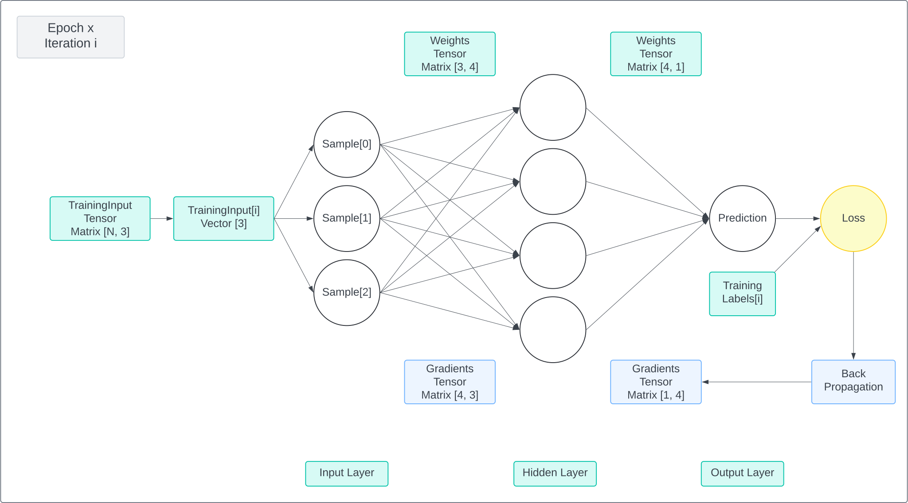

# Neural Network Overview

## Introduction

Neural networks are a class of machine learning algorithms designed to recognise patterns and relationships in data through a process of learning, making them powerful tools for various applications such as image and speech recognition, natural language processing, and autonomous systems.

The network consists of nodes, organised into layers and connected with weights. Data flows through the network over all the connections, combining mathematically with the weights.&#x20;

We can visualise a neural network as three layers, the input, hidden and output layers. The hidden layer is where the processing occurs. The cool thing is that we can design architectures consisting of different layer types, where each layer encapsulates it's own processing with an input, hidden and output layer, almost like small nested neural networks inside the main architecture. We will look at common layer types later on.

### Goal

The goal of training a network is to generate a model that can accurately predict/categorise/generate results. E.g. the MNIST dataset contains images of written letters of the alphabet, with which we can send each image's data through the network and then compare the network's prediction to the known letter. The predicted value is compared to the expected value and allows us to calculate the error (loss) of the network. Once we know this, the key is to then propagate this error backwards through the network, calculating the partial error (gradient) produced by each connection (weight). Moving backwards through the layers mathematically allows us to compute how each weight contributes to the error at it's output node. The weight are then adjusted across the whole network, in order to reduce the error on the next iteration. We repeat this process with the same dataset and the updated weights, and use the loss value on every iteration to gradually tweak the network's computation to reach an acceptable loss value, i.e. accurate predictions.

### Network Design

<figure><figcaption><p>Training iteration</p></figcaption></figure>

### Training code sample

```go
func (nn *NeuralNetwork) Train(data, targets []tensor.Interface, epochs int) {
	for epoch := 0; epoch < epochs; epoch++ {
		var epochLoss float64
		for i := 0; i < len(data); i++ {
			output := nn.Forward(data[i])
			lossV, grad := nn.lossFunction.Compute(output, targets[i])
			epochLoss += lossV.Data()[0]
			nn.Backward(grad)
			nn.Regularise()
			nn.Optimise()
			nn.ZeroGradients()
		}
		epochLoss /= float64(len(data))
		fmt.Printf("Epoch %d, Loss: %f\n", epoch, epochLoss)
	}
}
```
